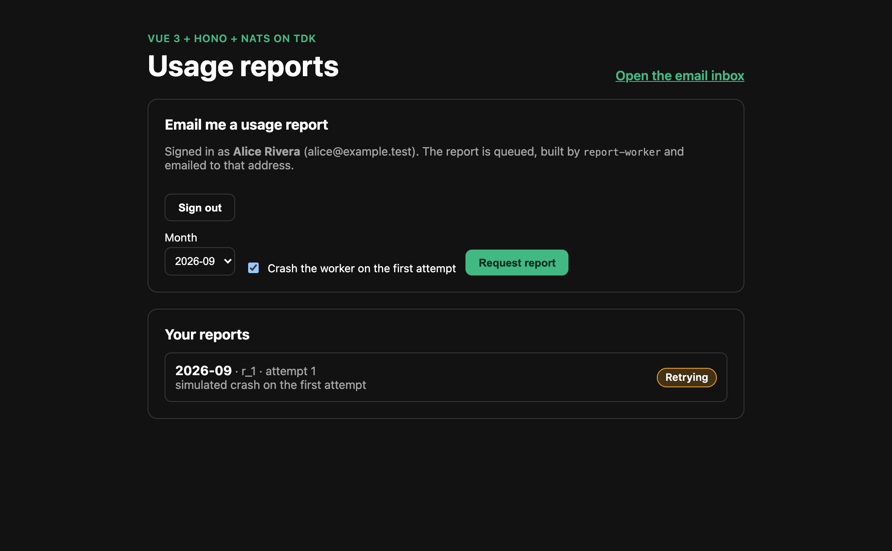
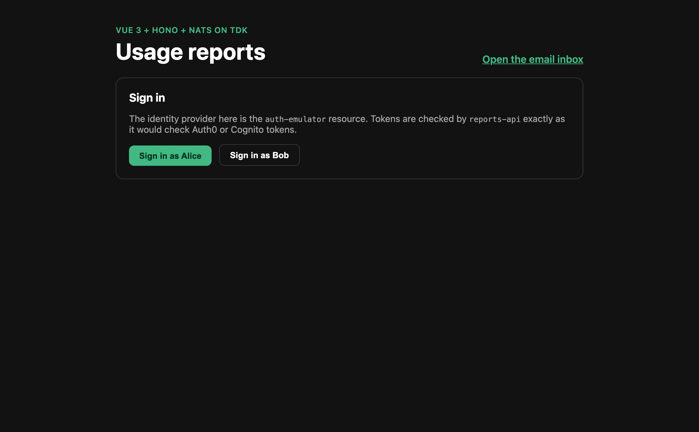
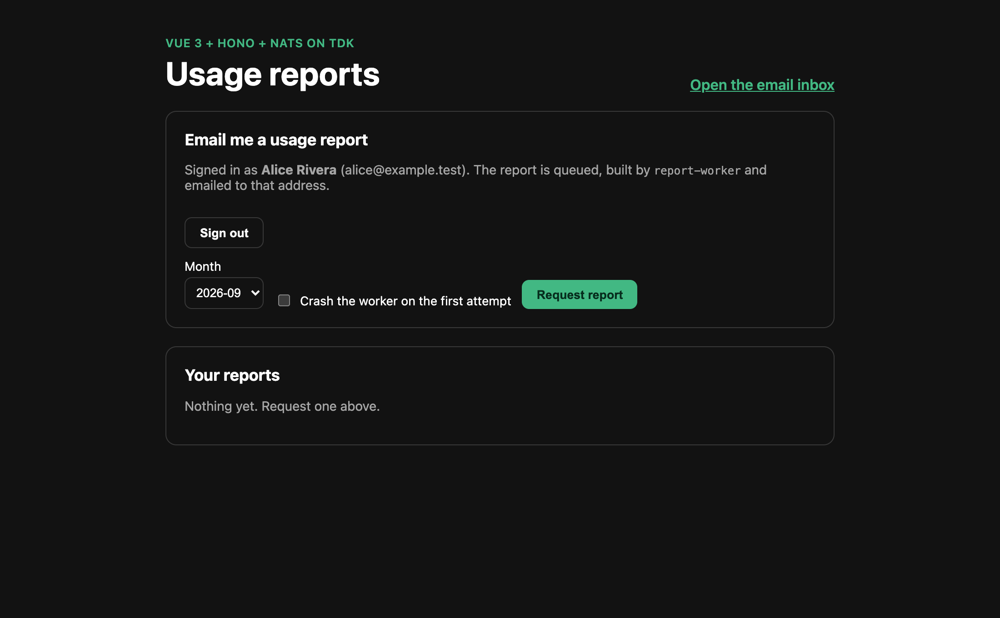
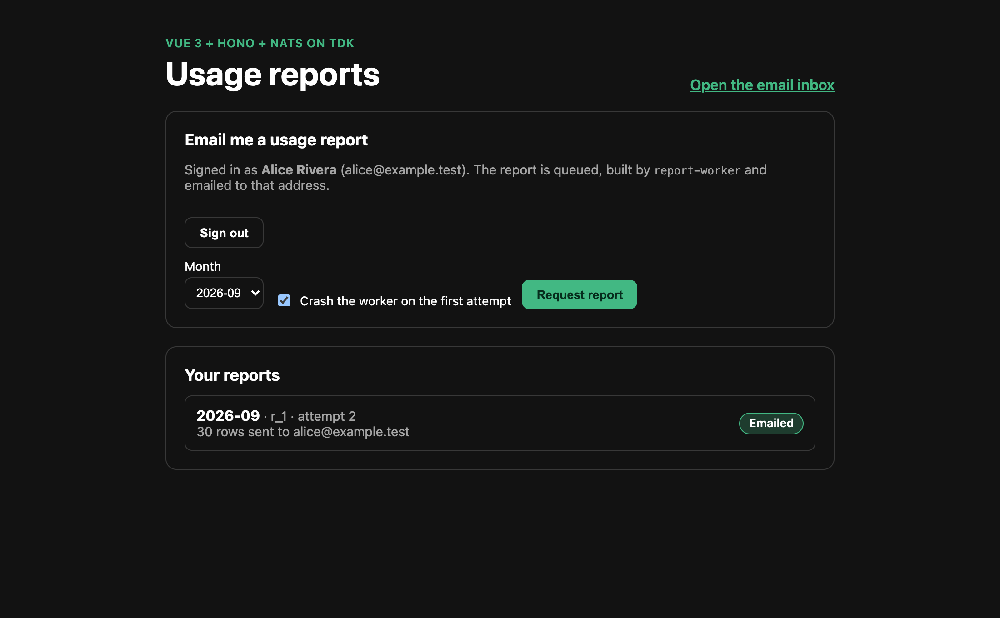
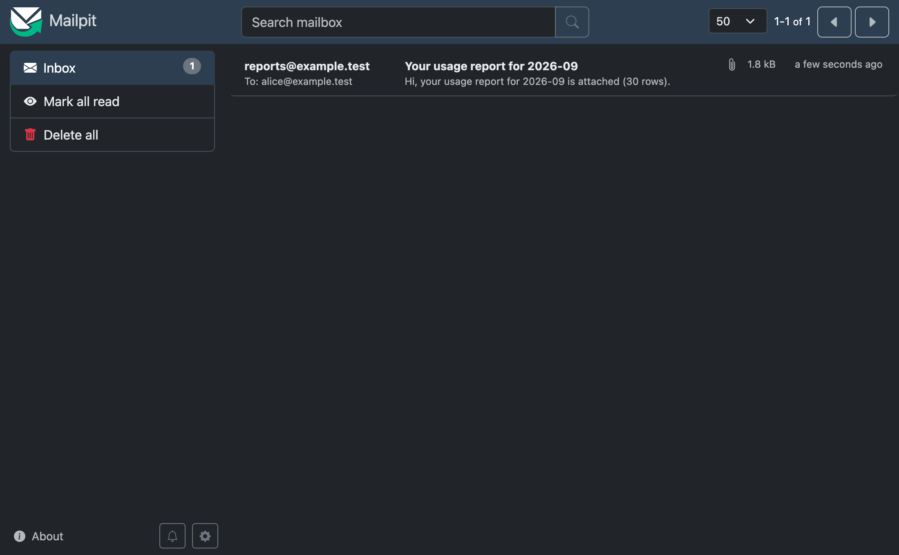
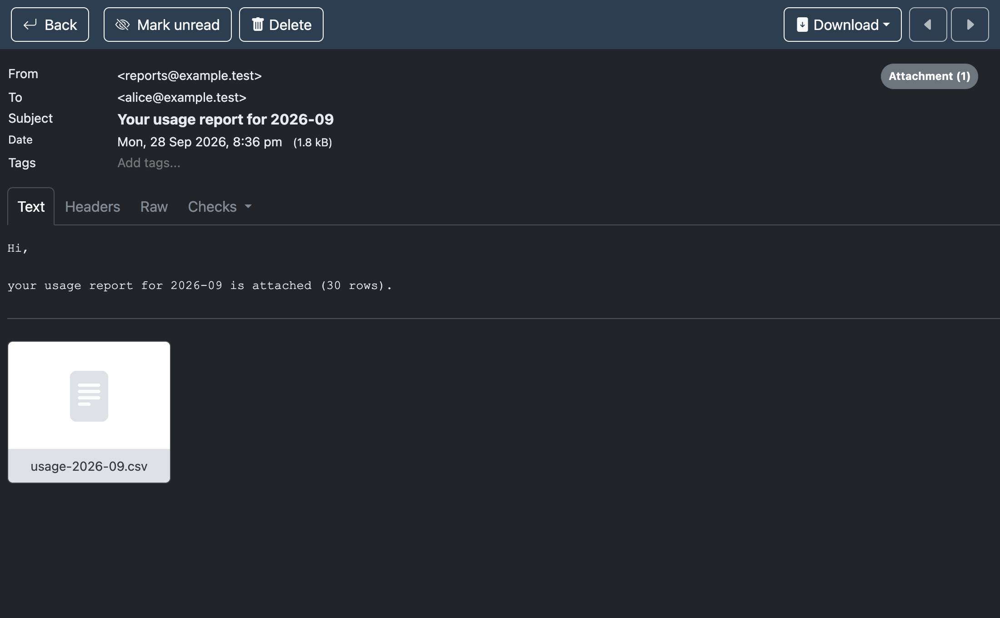

# TDK Auth + Queue + Email Example (Vue + Hono + NATS)

**How do you run the parts of your stack that only exist as managed cloud services, like an identity provider, a queue or outbound email, on your laptop?**

This example answers that with one small app: sign in, click **Email me a usage report**, and a worker builds a CSV and emails it to you. Each managed service is a normal TDK resource or container next to your code, and the app talks to an interface, not to a vendor.

| Managed service | Local stand-in | What the app depends on |
| --- | --- | --- |
| Identity provider (Auth0, Cognito, Entra ID) | [`auth-emulator`](services/identity/auth-emulator): an OIDC issuer with discovery, JWKS and a token endpoint | an issuer, a JWKS URL and an audience (`params` in [`reports-api/service.json`](services/reports/reports-api/service.json)) |
| Queue (SQS, Pub/Sub, Service Bus) | [NATS JetStream](services/platform/messaging/docker-compose.yml): durable, at-least-once, redelivers on failure | the [`Queue` interface](services/reports/reports-api/src/queue.ts) |
| Email (SES, SendGrid) | [Mailpit](services/platform/messaging/docker-compose.yml): an SMTP server with an inbox UI | the [`Mailer` interface](services/reports/report-worker/src/mailer.ts) |



## What it looks like

| 1. Sign in | 2. Signed in as Alice |
| --- | --- |
|  |  |

| 3. Worker crashed, queue is retrying | 4. Second attempt succeeded |
| --- | --- |
|  |  |

| 5. The email arrived in Mailpit | 6. With the CSV attached |
| --- | --- |
|  |  |

## Run it

> **Requires TDK CLI 1.3.75 or newer** (the Vue frontend needs `"framework": "vue"`). Prerequisites: Docker running, [Tilt](https://docs.tilt.dev/install.html), [Bun](https://bun.sh/docs/installation) and the [TDK CLI](https://github.com/tdk-landscape/tdk-cli-core#installation).

```bash
git clone https://github.com/tdk-landscape/tdk-auth-queue-email-example.git
cd tdk-auth-queue-email-example
tdk project        # creates .env and the generated config in a fresh clone
tdk up
```

The first start builds the images and takes a few minutes.

> [!WARNING]
> **Known issue, [tdk-cli-core#155](https://github.com/tdk-landscape/tdk-cli-core/issues/155):** `tdk up` currently starts the apps but leaves `nats` and `mailpit` disabled in Tilt. Enable them once, and the worker connects on its next retry:
>
> ```bash
> tilt enable nats mailpit
> ```
>
> You can also click **Enable** on both in the Tilt UI (`http://localhost:10350`). If Tilt says that port is taken, `tdk up` printed the port it picked instead.

| Resource | Type | Stack | URL |
| --- | --- | --- | --- |
| [`web`](services/reports/web) | Vue 3 app | `reports` | http://app.tdk-auth-queue-email-example.localhost/reports/ |
| [`reports-api`](services/reports/reports-api) | Hono API | `reports` | http://api.tdk-auth-queue-email-example.localhost/api/reports |
| [`report-worker`](services/reports/report-worker) | queue worker | `reports` | none (it has no HTTP server) |
| [`auth-emulator`](services/identity/auth-emulator) | Hono OIDC issuer | `identity` | http://api.tdk-auth-queue-email-example.localhost/api/auth-emulator |
| Mailpit | SMTP + inbox UI | infra | http://localhost:8025 |
| NATS | JetStream | infra | internal (`TILT_NATS_URL`) |

Sign in as **Alice** (`alice` / `alice-pass`) or **Bob** (`bob` / `bob-pass`). Tick **Crash the worker on the first attempt** to watch the queue redeliver the job: the report shows *Retrying*, then *Emailed* on attempt 2, and Mailpit holds exactly one email.

`tdk down` stops everything.

## How each piece stays cloud-ready

**Identity.** `reports-api` never asks the emulator anything special. It fetches signing keys from `OIDC_JWKS_URL` and checks signature, issuer and audience, as it would for Auth0 or Cognito ([`auth.ts`](services/reports/reports-api/src/auth.ts)). The user's email comes from the token's `email` claim, so the worker mails whoever the identity provider says the user is. Point the three `params` at your tenant to verify real tokens. The issuer the token carries (public URL) and the JWKS URL the API fetches from (internal `http://auth-emulator:4400/...`) are separate on purpose.

**Queue.** [`Queue`](services/reports/reports-api/src/queue.ts) has `publish` and `subscribe` with at-least-once semantics: resolve to acknowledge, throw to be redelivered. [`NatsQueue`](services/reports/reports-api/src/nats-queue.ts) implements it with JetStream. An SQS or Pub/Sub implementation is one more class. The worker reports progress back on a second subject, so the API never calls the worker. `report-worker` gives up after 3 attempts and reports `failed`, instead of retrying forever.

**Email.** [`Mailer`](services/reports/report-worker/src/mailer.ts) has one method. Locally it is plain SMTP into Mailpit, whose inbox shows what a real recipient would get, attachment included.

## What this does not do

Be clear about what a stand-in is:

- The emulator is **not a security product**. Users are hard-coded, and the signing key is regenerated on every start, so tokens die with the container. It does not do refresh tokens, MFA, social login or a redirect (authorization code + PKCE) flow. The password grant is only the shortest path to a token. A real provider needs a different sign-in step in `web`; the API side stays the same.
- Only `Queue` has one real implementation (NATS). Nothing here is tested against SQS, and JetStream is not SQS: ordering, visibility timeouts and dead-letter queues differ. Keep the interface small and test each real adapter against the real service.
- `SmtpMailer` sends without credentials. Using SES or SendGrid over SMTP needs `SMTP_USER` and `SMTP_PASSWORD` support, which is a few lines but not here.
- TDK starts NATS only when `services/platform/messaging/docker-compose.yml` exists, and it does not generate that file. This repo ships one. The container name and network in it follow TDK's naming (`<project>_nats`, `<project>_backend`).
- Reports are held in memory in `reports-api`, and restarting it forgets them.

## Test it

```bash
bun install
cd services/identity/auth-emulator && bunx vitest run
cd ../../reports/reports-api && bunx vitest run
cd ../report-worker && bunx vitest run
cd ../web && bunx vitest run && bun run build
```

21 tests. The queue and mailer have in-memory test doubles, so the retry behavior is tested without a broker: a crash on attempt 1 sends exactly one email on attempt 2, and a permanently failing mailer ends as `failed` after three attempts. The real token check (JWKS, issuer, audience) is not in the unit tests. Run the stack and sign in to exercise it.

`bun run build` runs `tsc && vite build --config .autogenerated/vite.config.build.autogenerated.ts`, the command the Docker image runs. The config file appears after the first `tdk up` (or `tdk config regenerate`).

`tdk doctor` checks this kind of wiring before you start: a resource without a `package.json`, a `params` URL that uses the wrong port for another service, a frontend calling a backend on `localhost:<port>`, the `nats` feature with no NATS to start.

## How it was made

```bash
mkdir tdk-auth-queue-email-example && cd tdk-auth-queue-email-example
tdk project --yes
tdk resource auth-emulator --type backend --stack identity
tdk resource reports-api --type backend --stack reports
tdk resource report-worker --type worker --stack reports
tdk resource web --type frontend --framework vue --stack reports
```

Resources live under `services/<stack>/<name>/`, which is where `discovery.paths` in `.tdk/project.json` looks. Each `service.json` is the whole TDK contract for its service.

> [!IMPORTANT]
> Edit `service.json` or the sources. Never edit `.autogenerated/`; TDK regenerates it.

The queue code is duplicated in `reports-api` and `report-worker` (and the `events.ts` message contract, which you must keep in sync). A shared TDK `sdk` resource would remove that, at the cost of more moving parts for an example.

## License

MIT
